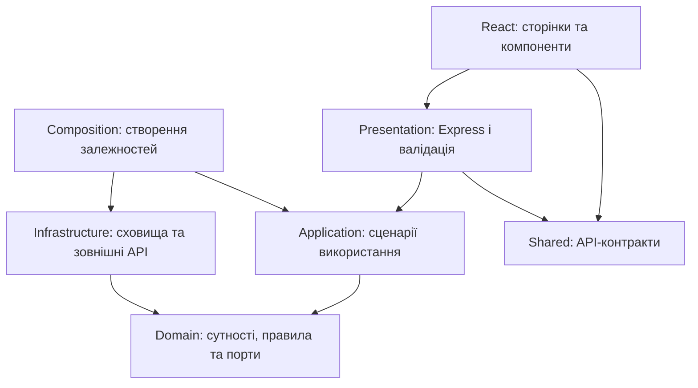
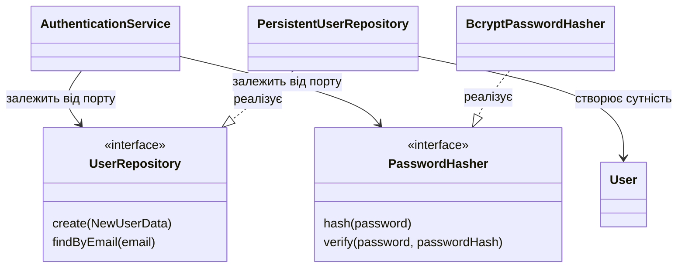
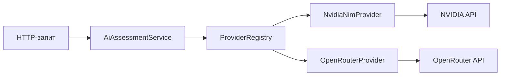

# Архітектура Незбіг

Стрілка означає залежність коду. Інфраструктура реалізує порти домену; створення залежностей винесено в composition.

```mermaid
flowchart TB
  Client[React: сторінки та компоненти] --> HTTP[Presentation: Express і валідація]
  HTTP --> App[Application: сценарії використання]
  App --> Domain[Domain: сутності, правила та порти]
  Infra[Infrastructure: сховища та зовнішні API] --> Domain
  Root[Composition: створення залежностей] --> App
  Root --> Infra
  Client --> Shared[Shared: API-контракти]
  HTTP --> Shared
```

## Основні об’єкти авторизації

```mermaid
classDiagram
  AuthenticationService --> UserRepository : залежить від порту
  AuthenticationService --> PasswordHasher : залежить від порту
  PersistentUserRepository ..|> UserRepository : реалізує
  BcryptPasswordHasher ..|> PasswordHasher : реалізує
  PersistentUserRepository --> User : створює сутність
  class UserRepository {
    <<interface>>
    create(NewUserData)
    findByEmail(email)
  }
  class PasswordHasher {
    <<interface>>
    hash(password)
    verify(password, passwordHash)
  }
```

## ШІ-думка

```mermaid
flowchart LR
  Route[HTTP-запит] --> Service[AiAssessmentService]
  Service --> Registry[ProviderRegistry]
  Registry --> NIM[NvidiaNimProvider]
  Registry --> Router[OpenRouterProvider]
  NIM --> API1[NVIDIA API]
  Router --> API2[OpenRouter API]
```
