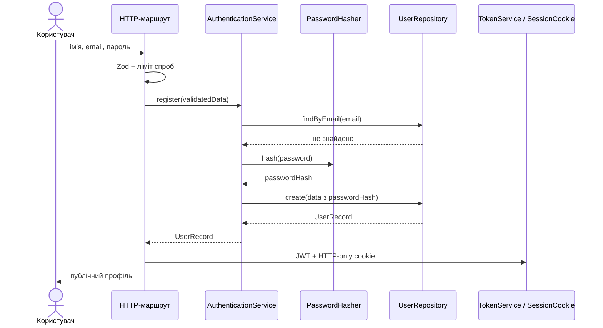
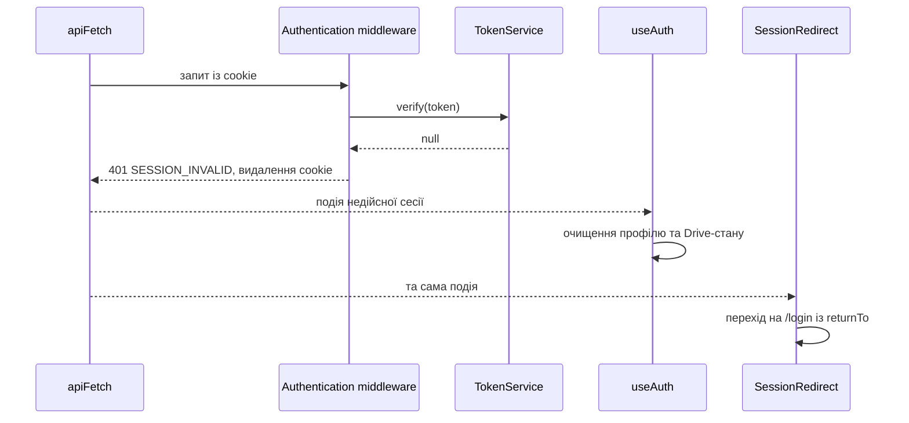
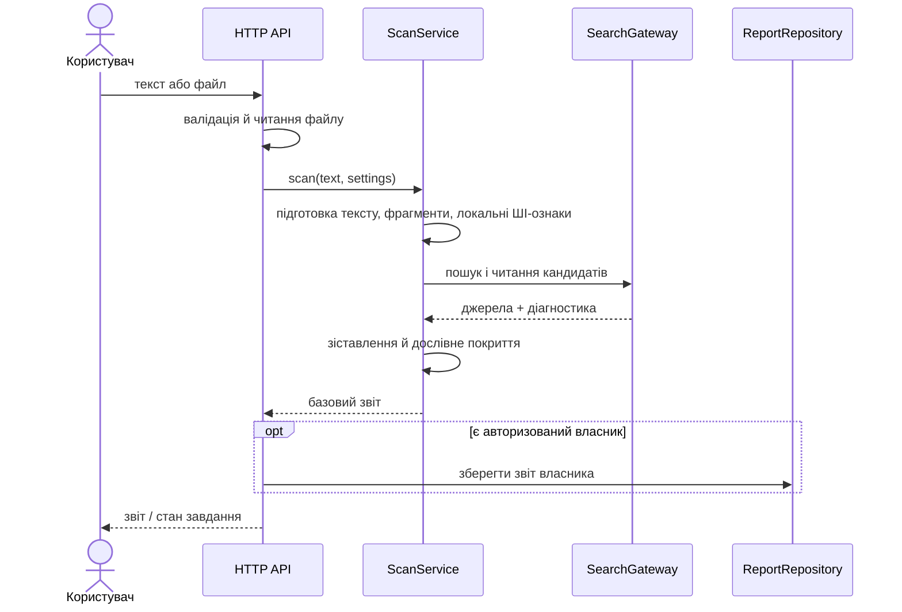

# Послідовності запитів

## Реєстрація

```mermaid
sequenceDiagram
  actor U as Користувач
  participant H as HTTP-маршрут
  participant A as AuthenticationService
  participant P as PasswordHasher
  participant R as UserRepository
  participant S as TokenService / SessionCookie
  U->>H: ім’я, email, пароль
  H->>H: Zod + ліміт спроб
  H->>A: register(validatedData)
  A->>R: findByEmail(email)
  R-->>A: не знайдено
  A->>P: hash(password)
  P-->>A: passwordHash
  A->>R: create(data з passwordHash)
  R-->>A: UserRecord
  A-->>H: UserRecord
  H->>S: JWT + HTTP-only cookie
  H-->>U: публічний профіль
```

## Недійсна сесія

```mermaid
sequenceDiagram
  participant C as apiFetch
  participant M as Authentication middleware
  participant T as TokenService
  participant A as useAuth
  participant N as SessionRedirect
  C->>M: запит із cookie
  M->>T: verify(token)
  T-->>M: null
  M-->>C: 401 SESSION_INVALID, видалення cookie
  C-->>A: подія недійсної сесії
  A->>A: очищення профілю та Drive-стану
  C-->>N: та сама подія
  N->>N: перехід на /login із returnTo
```

## Перевірка документа

```mermaid
sequenceDiagram
  actor U as Користувач
  participant H as HTTP API
  participant S as ScanService
  participant W as SearchGateway
  participant R as ReportRepository
  U->>H: текст або файл
  H->>H: валідація й читання файлу
  H->>S: scan(text, settings)
  S->>S: підготовка тексту, фрагменти, локальні ШІ-ознаки
  S->>W: пошук і читання кандидатів
  W-->>S: джерела + діагностика
  S->>S: зіставлення й дослівне покриття
  S-->>H: базовий звіт
  opt є авторизований власник
    H->>R: зберегти звіт власника
  end
  H-->>U: звіт / стан завдання
```

Додаткова ШІ-думка викликається окремим запитом. Вона не підміняє базові збіги або локальний індикатор.
